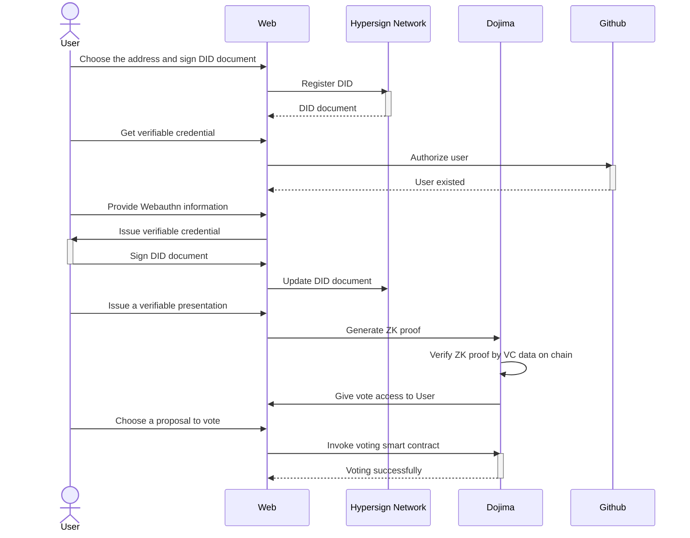

<div align="center">
<h1>BeePoll</h1>


[](./LICENSE) [](https://github.com/EricLin0619/BeePoll/deployments)

</div>

> Anti-Sybil Mechanism Voting System with Hypersign DID

### Demo Page
- WebPage: https://bee-poll.vercel.app/ 
- Video: https://youtu.be/L2nz_1APt4k
- Goerli Vote Contract: [0xCEFbaE8c6afEdC5C5e312B34fd8993EfD076d130](https://goerli.etherscan.io/address/0xCEFbaE8c6afEdC5C5e312B34fd8993EfD076d130)
- Dojima ID verifier Contract: [0x1bcD4B2C0A368a9E4a09D7ee158B88a28A7B8872](https://doj-bex-test.dojima.network/address/0x1bcD4B2C0A368a9E4a09D7ee158B88a28A7B8872#code)
- Dojima Vote Contract: [0x85248A76e867d8A70b9aC93d4806f0aAb2A2DA19](https://doj-bex-test.dojima.network/address/0x85248A76e867d8A70b9aC93d4806f0aAb2A2DA19#code)

### Abstract
Our project aims to revolutionize the web3 voting mechanism in DAOs by providing a secure and decentralized system. By integrating the EVM blockchain and Hypersign's DID service, we ensure verifiable identities, protection against sybil attacks, and the empowerment of voting.

Cutting-edge ZK-proofs are pivotal as they allow verifying data without exposing personal details, preserving voter privacy. This safeguards sensitive information during verification, ensuring voter anonymity and the security of their choices. Integrating Discord and GitHub enhances user experience while upholding privacy standards. 

Our vision is to empower global democratic processes, fostering trust and inclusivity. Join us on this transformative journey to amplify voices, uphold integrity, and reshape the future of voting. Together, let's build a resilient and accountable voting platform for all.

### Problem Statement
- Sybil Attack in Web3: The risk of one participant creating multiple fake identities to manipulate decentralized systems.
- Weak Association with the Real World: Difficulty verifying digital identities against real individuals in decentralized setups.
- Centralization for Issue Verification: Balancing decentralized principles with the need for centralized verification in web3.
- Web2 and Web3 Verification Challenges: Bridging verification gaps between traditional and decentralized web paradigms.

### Solution
- **Hypersign Integration**: Leveraging Hypersign's robust DID schema and VC issuance capabilities to seamlessly integrate identities from Web2 to Web3 platforms.
- **WebAuthn Transition**: Utilizing WebAuthn to securely capture user biometrics for effortless Web2-to-Web3 login, ensuring a singular and verified identity.
- Z**K-proofs for Privacy**: Implementing non-interactive ZK-proofs for efficient off-chain generation and on-chain validation, supporting diverse signature schemes like ed25519.
- **Cross-Chain Compatibility**: Embracing IBC support for cross-chain interactions and utilizing cosmwasm to facilitate voting across multiple chains, ensuring comprehensive multi-chain participation.

### Technical Architecture


### Build & Installation

1. Deploy ZK On-chain Verifier and Voting Contract 
``` bash
cd packages/sol-bee-poll
npm install
npm run circom # build circuits and generate proof
npm run deploy:zk
npm run deploy
```

2. Start the Frontend
```bash
cd ../../ # or open beepoll dir
npm install
npm run dev
```

Optional. Build and Copy Static to S3 (maybe need some adjustment)
```bash
npm run build
```

### Challenges

1. Hypersign's DID Challenges: VC issue problem, only support specific service and not metion in document
2. Signature Verify in ZK: ED25519 verify is hard in circuit, maybe need to use some commitment map or others
3. Cross-Chain IBC support: Hypersign VC module is hard to use IBC, and not support WASM on-chain. Not very easy to leverage it with cosmos infra

### Contributer
- Frontend + HyperSign [EricLin0619](https://github.com/EricLin0619)
- HyperSign DID and WebAuthn [musiccat1020](https://github.com/musicat1020)
- ZK & Smart Contract [kidneyweakx](https://github.com/kidneyweakx)